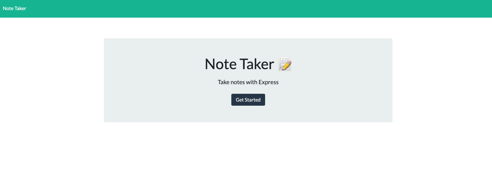
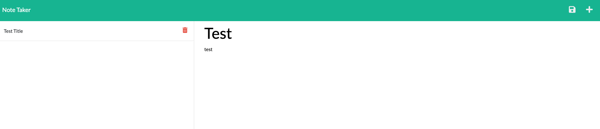

# Note-Taker
    
## Description
Build an application to write and save notes in order to organize thoughts and keep track of completed tasks.

## Table of Contents
* [Installation](#installation)
* [Usage](#usage)
* [Screenshot](#screenshot)
* [License](#license)
* [Questions](#questions)

## Installation
Clone repo from GitHub, install node.js, run npm i from root directory.

## Usage
Once you click Get Started you can view exisiting notes on the left hand column. When you enter a new note title and note's text a save icon should appear to save the note. Once saved, the note should appear on the left hand column. Click on the trash icon to delete a note.

## Screenshot

## License
MIT

## Questions
Email: chindatrate@me.com

GitHub: https://github.com/chindatrate